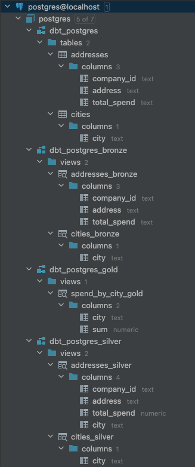

Introduction
===

In this project, I'll be taking my first steps with [DBT](https://www.getdbt.com). I'll be following the use case from [Solve any data analysis problem, Chapter 2](https://github.com/davidasboth/solve-any-data-analysis-problem/blob/main/chapter-2/Chapter%202%20example%20solution.ipynb) as I did before, but this time I'll be using DBT.

DBT allows me to implement data transforms as a collection of SQL scripts which can be easily run in a simple and consistent manner. I'll use DBT with postgres since that's an easy starting point for me.

> I already have postgres running in a docker container and python 3 installed.
> ```shell
> python --version
> Python 3.10.12
> ```

To start with, I'll set up my environment:

```shell
python -m venv venv
source ./venv/bin/activate
python -m pip install dbt-core dbt-postgres
pip install --upgrade pip
```
This creates a python virtual environment for this project, activates it, and installs DBT with the postgres extension.

Then I'll create a new DBT project:
```shell
(venv) paulrule@Pauls-MacBook-Air dbt-spike % dbt init
02:49:07  Running with dbt=1.8.4
Enter a name for your project (letters, digits, underscore): spike_postgres
02:49:26
Your new dbt project "spike_postgres" was created!

For more information on how to configure the profiles.yml file,
please consult the dbt documentation here:

  https://docs.getdbt.com/docs/configure-your-profile

One more thing:

Need help? Don't hesitate to reach out to us via GitHub issues or on Slack:

  https://community.getdbt.com/

Happy modeling!

02:49:26  Setting up your profile.
Which database would you like to use?
[1] postgres

(Don't see the one you want? https://docs.getdbt.com/docs/available-adapters)

Enter a number: 1
host (hostname for the instance): localhost
port [5432]:
user (dev username): postgres
pass (dev password):
dbname (default database that dbt will build objects in): postgres
schema (default schema that dbt will build objects in): public
threads (1 or more) [1]:
02:50:05  Profile spike_postgres written to /Users/paulrule/.dbt/profiles.yml using target's profile_template.yml and your supplied values. Run 'dbt debug' to validate the connection.
```
A new DBT project is created in the directory `spike_postgres`.
These details have been saved in `/Users/paulrule/.dbt/profiles.yml` and I can verify the connection with `dbt debug`:

```shell
% cd spike_postgres
% dbt debug       
00:15:02  Running with dbt=1.8.4
00:15:02  dbt version: 1.8.4
00:15:02  python version: 3.10.12
00:15:02  python path: /Users/paulrule/IdeaProjects/dbt-spike/venv/bin/python
00:15:02  os info: macOS-14.5-arm64-arm-64bit
00:15:02  Using profiles dir at /Users/paulrule/.dbt
00:15:02  Using profiles.yml file at /Users/paulrule/.dbt/profiles.yml
00:15:02  Using dbt_project.yml file at /Users/paulrule/IdeaProjects/dbt-spike/spike_postgres/dbt_project.yml
00:15:02  adapter type: postgres
00:15:02  adapter version: 1.8.2
00:15:02  Configuration:
00:15:02    profiles.yml file [OK found and valid]
00:15:02    dbt_project.yml file [OK found and valid]
00:15:02  Required dependencies:
00:15:02   - git [OK found]

00:15:02  Connection:
00:15:02    host: localhost
00:15:02    port: 5432
00:15:02    user: postgres
00:15:02    database: postgres
00:15:02    schema: dbt_postgres
00:15:02    connect_timeout: 10
00:15:02    role: None
00:15:02    search_path: None
00:15:02    keepalives_idle: 0
00:15:02    sslmode: None
00:15:02    sslcert: None
00:15:02    sslkey: None
00:15:02    sslrootcert: None
00:15:02    application_name: dbt
00:15:02    retries: 1
00:15:02  Registered adapter: postgres=1.8.2
00:15:02    Connection test: [OK connection ok]

00:15:02  All checks passed!
```

The project is initialised with some example 'models' in `spike_postgres/models/examples/` and I can use `dbt run` to check these work okay:

```shell
% dbt run
01:42:36  Running with dbt=1.8.4
01:42:36  Registered adapter: postgres=1.8.2
01:42:36  Unable to do partial parsing because saved manifest not found. Starting full parse.
01:42:37  Found 2 models, 4 data tests, 417 macros
01:42:37
01:42:37  Concurrency: 1 threads (target='dev')
01:42:37
01:42:37  1 of 2 START sql table model public.my_first_dbt_model ......................... [RUN]
01:42:37  1 of 2 OK created sql table model public.my_first_dbt_model .................... [SELECT 2 in 0.09s]
01:42:37  2 of 2 START sql view model public.my_second_dbt_model ......................... [RUN]
01:42:37  2 of 2 OK created sql view model public.my_second_dbt_model .................... [CREATE VIEW in 0.04s]
01:42:37
01:42:37  Finished running 1 table model, 1 view model in 0 hours 0 minutes and 0.40 seconds (0.40s).
01:42:37
01:42:37  Completed successfully
01:42:37
01:42:37  Done. PASS=2 WARN=0 ERROR=0 SKIP=0 TOTAL=2
```

First I need my raw data in postgres tables:

```shell
# download data from github
../run data:download
# load CSV files into postgres tables
../run data:load 
````
See [run](../run) for details on how this is done.
Now my raw data exists in postgres tables `addresses` and `cities` in a schema called `dbt_postgres`.

I'll delete the examples models and create new models:

```text
models
└── solve_any_data_analysis_problem_ch2
    ├── addresses_bronze.sql
    ├── addresses_silver.sql
    ├── cities_bronze.sql
    ├── cities_silver.sql
    ├── schema.yml
    └── spend_by_city_gold.sql
```
I've followed a bronze/silver/gold approach to modelling - perhaps a little unnecessary here but it illustrates how it works:

- [cities_bronze.sql](./models/solve_any_data_analysis_problem_ch2/cities_bronze.sql) simply selects everything from the raw table
  - ```sql
    {{ config(schema='bronze')}} 
    select * from dbt_postgres."cities"
    ```
  - this produces a view in the `dbt_postgres_bronze` schema called `cities_bronze`
- [addresses_bronze.sql](./models/solve_any_data_analysis_problem_ch2/addresses_bronze.sql) simply selects everything from the raw table
  - ```sql
    {{ config(schema='bronze')}} 
    select * from dbt_postgres."addresses"
    ```
  - this produces a view in the `dbt_postgres_bronze` schema called `addresses_bronze`

The silver models do some cleaning and transformation:

- [cities_silver.sql](./models/solve_any_data_analysis_problem_ch2/cities_silver.sql)
  - ```sql
    {{ config(schema='silver')}}
    
        -- trim and uppercase city
        -- remove '*'
        -- remove rows where city is empty
        -- remove rows where city is in specified list
    
    SELECT
      trim(upper(
        replace(city, '*', '')
      )) as city
    FROM {{ ref('cities_bronze') }}
    where city is not null
    and not city in ('England', 'Scotland', 'Wales', 'Northern Ireland')
     ```
  - this produces a view in the `dbt_postgres_silver` schema called `cities_silver`
- [addresses_silver.sql](./models/solve_any_data_analysis_problem_ch2/addresses_silver.sql) 
  - ```sql
    {{ config(schema='silver')}}
    
    -- upper case address
    -- cast total_spend to decimal
    -- match the address to a city from the cities table
    -- remove rows with no address
    -- use OTHER when no match for city
    
    SELECT
        company_id,
        upper(address) as address,
        cast (total_spend as decimal) AS total_spend,
        coalesce(
            (select city from {{ ref('cities_silver') }} where UPPER(address) like '%'||chr(10)||city||',%' order by city desc limit 1),
            'OTHER'
        ) as city
    
    FROM {{ ref('addresses_bronze') }}
    
    where address is not null
    ```
  - this produces a view in the `dbt_postgres_silver` schema called `addresses_silver`

And finally in gold, we have the aggregated data which can be used to answer the business question.

- [spend_by_city_gold.sql](./models/solve_any_data_analysis_problem_ch2/spend_by_city_gold.sql)
  - ```sql
    {{ config(schema='gold')}}
    
    select city, sum(total_spend) from {{ ref('addresses_silver') }} group by city
    ```
  - this produces a view in the `dbt_postgres_gold` schema called `spend_by_city_gold`

After executing `dbt run` the database now looks like this:



```shell
 % dbt run
06:41:53  Running with dbt=1.8.4
06:41:53  Registered adapter: postgres=1.8.2
06:41:53  Unable to do partial parsing because a project config has changed
06:41:54  Found 5 models, 5 data tests, 417 macros
06:41:54  
06:41:54  Concurrency: 1 threads (target='dev')
06:41:54  
06:41:54  1 of 5 START sql view model dbt_postgres_bronze.addresses_bronze ............... [RUN]
06:41:54  1 of 5 OK created sql view model dbt_postgres_bronze.addresses_bronze .......... [CREATE VIEW in 0.08s]
06:41:54  2 of 5 START sql view model dbt_postgres_bronze.cities_bronze .................. [RUN]
06:41:54  2 of 5 OK created sql view model dbt_postgres_bronze.cities_bronze ............. [CREATE VIEW in 0.03s]
06:41:54  3 of 5 START sql view model dbt_postgres_silver.cities_silver .................. [RUN]
06:41:54  3 of 5 OK created sql view model dbt_postgres_silver.cities_silver ............. [CREATE VIEW in 0.03s]
06:41:54  4 of 5 START sql view model dbt_postgres_silver.addresses_silver ............... [RUN]
06:41:54  4 of 5 OK created sql view model dbt_postgres_silver.addresses_silver .......... [CREATE VIEW in 0.03s]
06:41:54  5 of 5 START sql view model dbt_postgres_gold.spend_by_city_gold ............... [RUN]
06:41:54  5 of 5 OK created sql view model dbt_postgres_gold.spend_by_city_gold .......... [CREATE VIEW in 0.03s]
06:41:54  
06:41:54  Finished running 5 view models in 0 hours 0 minutes and 0.42 seconds (0.42s).
06:41:55  
06:41:55  Completed successfully
06:41:55  
06:41:55  Done. PASS=5 WARN=0 ERROR=0 SKIP=0 TOTAL=5
```

Now, I know the raw data has quality problems, since those are addressed in the cleaning and transforming in the silver models.
So I don't necessarily want to validate the bronze models at the moment, but I do want to validate the silver models so I know I've done the cleaning properly.

I've added [schema.yml](./models/solve_any_data_analysis_problem_ch2/schema.yml) and added a few column level checks - this is also where I can add some documentation.

For example:

```yaml
models:
  - name: addresses_silver
    description: "addresses"
    columns:
      - name: company_id
        description: "Company"
        data_tests:
          - not_null
```

Run the tests with `dbt test`:

```shell
% dbt test
07:28:00  Running with dbt=1.8.4
07:28:00  Registered adapter: postgres=1.8.2
07:28:00  Found 5 models, 6 data tests, 417 macros
07:28:00  
07:28:00  Concurrency: 1 threads (target='dev')
07:28:00  
07:28:00  1 of 6 START test not_null_addresses_silver_address ............................ [RUN]
07:28:00  1 of 6 PASS not_null_addresses_silver_address .................................. [PASS in 0.09s]
07:28:00  2 of 6 START test not_null_addresses_silver_city ............................... [RUN]
07:28:06  2 of 6 PASS not_null_addresses_silver_city ..................................... [PASS in 5.20s]
07:28:06  3 of 6 START test not_null_addresses_silver_company_id ......................... [RUN]
07:28:06  3 of 6 PASS not_null_addresses_silver_company_id ............................... [PASS in 0.03s]
07:28:06  4 of 6 START test not_null_addresses_silver_total_spend ........................ [RUN]
07:28:06  4 of 6 PASS not_null_addresses_silver_total_spend .............................. [PASS in 0.03s]
07:28:06  5 of 6 START test not_null_cities_silver_city .................................. [RUN]
07:28:06  5 of 6 PASS not_null_cities_silver_city ........................................ [PASS in 0.02s]
07:28:06  6 of 6 START test unique_cities_silver_city .................................... [RUN]
07:28:06  6 of 6 FAIL 1 unique_cities_silver_city ........................................ [FAIL 1 in 0.02s]
07:28:06  
07:28:06  Finished running 6 data tests in 0 hours 0 minutes and 5.59 seconds (5.59s).
07:28:06  
07:28:06  Completed with 1 error and 0 warnings:
07:28:06  
07:28:06  Failure in test unique_cities_silver_city (models/solve_any_data_analysis_problem_ch2/schema.yml)
07:28:06    Got 1 result, configured to fail if != 0
07:28:06  
07:28:06    compiled code at target/compiled/spike_postgres/models/solve_any_data_analysis_problem_ch2/schema.yml/unique_cities_silver_city.sql
07:28:06  
07:28:06  Done. PASS=5 WARN=0 ERROR=1 SKIP=0 TOTAL=6
```

We see that the unique test for the `city` column in the `cities_silver` view failed. This is good, because I can now fix that in the `cities_silver.sql` model.

After fixing that, and doing a `dbt run` to recreate the views, a `dbt test` now passes.

```shell
% dbt test
07:30:11  Running with dbt=1.8.4
07:30:11  Registered adapter: postgres=1.8.2
07:30:11  Found 5 models, 6 data tests, 417 macros
07:30:11  
07:30:11  Concurrency: 1 threads (target='dev')
07:30:11  
07:30:11  1 of 6 START test not_null_addresses_silver_address ............................ [RUN]
07:30:11  1 of 6 PASS not_null_addresses_silver_address .................................. [PASS in 0.09s]
07:30:11  2 of 6 START test not_null_addresses_silver_city ............................... [RUN]
07:30:16  2 of 6 PASS not_null_addresses_silver_city ..................................... [PASS in 5.21s]
07:30:16  3 of 6 START test not_null_addresses_silver_company_id ......................... [RUN]
07:30:16  3 of 6 PASS not_null_addresses_silver_company_id ............................... [PASS in 0.03s]
07:30:16  4 of 6 START test not_null_addresses_silver_total_spend ........................ [RUN]
07:30:16  4 of 6 PASS not_null_addresses_silver_total_spend .............................. [PASS in 0.03s]
07:30:16  5 of 6 START test not_null_cities_silver_city .................................. [RUN]
07:30:16  5 of 6 PASS not_null_cities_silver_city ........................................ [PASS in 0.02s]
07:30:16  6 of 6 START test unique_cities_silver_city .................................... [RUN]
07:30:16  6 of 6 PASS unique_cities_silver_city .......................................... [PASS in 0.02s]
07:30:16  
07:30:16  Finished running 6 data tests in 0 hours 0 minutes and 5.55 seconds (5.55s).
07:30:16  
07:30:16  Completed successfully
07:30:16  
07:30:16  Done. PASS=6 WARN=0 ERROR=0 SKIP=0 TOTAL=6
```

And now to check the results against the reference implementation:

```sql
select sum(SUM) from dbt_postgres_gold.spend_by_city_gold ;
-- expected 490374100
-- actual   490374100

select sum(SUM) from dbt_postgres_gold.spend_by_city_gold where city in ('LONDON');
-- EXPECTED 103042800
-- ACTUAL   103042800

select sum(SUM) from dbt_postgres_gold.spend_by_city_gold where city not in ('LONDON');
-- expected 387331300
-- actual   387331300

select sum(SUM) from dbt_postgres_gold.spend_by_city_gold where city not in ('LONDON','OTHER')
-- expected 119468400
-- actual   118044200
```
There is a small discrepancy in the last number which warrants looking into in more detail - but there's still a lot more to do, and that's enough for today's post. 

### Resources:
- Learn more about dbt [in the docs](https://docs.getdbt.com/docs/introduction)
- Check out [Discourse](https://discourse.getdbt.com/) for commonly asked questions and answers
- Join the [chat](https://community.getdbt.com/) on Slack for live discussions and support
- Find [dbt events](https://events.getdbt.com) near you
- Check out [the blog](https://blog.getdbt.com/) for the latest news on dbt's development and best practices